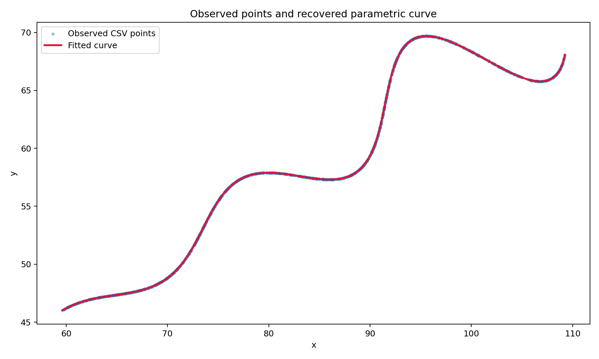

# R&D Technical Assignment: Parametric Curve Parameter Estimation

> A reproducible optimisation-based solution for recovering hidden parameters from unordered observations of a nonlinear parametric curve.



---

## Overview

This repository contains my solution to an R&D parameter-estimation problem.

The task is to recover the unknown parameters `θ`, `M`, and `X` of a nonlinear parametric curve using 1,500 supplied `(x, y)` observations. A key challenge is that the observations are unordered: the corresponding parameter value `t` is not provided for any row.

Rather than relying on visual inspection or assuming a point order, this solution formulates the problem as a constrained nonlinear optimisation task and estimates the parameters directly from the geometry of the curve.

---

## Problem Definition

The observed points lie on the following curve:

```text
x(t) = t cos(θ) - exp(M|t|) sin(0.3t) sin(θ) + X

y(t) = 42 + t sin(θ) + exp(M|t|) sin(0.3t) cos(θ)
```

### Parameter Constraints

| Variable | Constraint | Description |
| :--- | :--- | :--- |
| `θ` | `0° < θ < 50°` | Rotation angle |
| `M` | `-0.05 < M < 0.05` | Exponential growth factor |
| `X` | `0 < X < 100` | Horizontal translation |
| `t` | `6 < t < 60` | Curve parameter |

---

## Final Estimated Parameters

| Parameter | Optimised estimate | Final value |
| :--- | ---: | ---: |
| `θ` | `0.523598303` radians | `π/6` radians = `30°` |
| `M` | `0.029999997` | `0.03` |
| `X` | `54.999998` | `55` |

### Final Answer

```text
θ = π/6 radians = 0.523598776
M = 0.03
X = 55
```

---

## Desmos Expression

Use the following expression in Desmos with the range `6 < t < 60`.

```text
(
t*cos(0.523598776)
- e^(0.03*abs(t))*sin(0.3*t)*sin(0.523598776)
+ 55,

42
+ t*sin(0.523598776)
+ e^(0.03*abs(t))*sin(0.3*t)*cos(0.523598776)
)
```

---

## Research Methodology

### Challenge

The supplied CSV contains only coordinate pairs. It does not contain the corresponding parameter value `t`, and the rows are unordered.

Therefore, assuming that the CSV row index represents the value of `t` would be invalid. The solution must infer the curve parameters directly from the observed geometry.

### Inverse Geometric Transformation

For a candidate parameter set `(θ, M, X)`, each observed point is transformed back into the local coordinate system of the curve.

```text
tᵢ = cos(θ)(xᵢ - X) + sin(θ)(yᵢ - 42)

bᵢ = -sin(θ)(xᵢ - X) + cos(θ)(yᵢ - 42)
```

For the correct parameter values, the local vertical component must satisfy:

```text
bᵢ = exp(Mtᵢ) × sin(0.3tᵢ)
```

The residual for every observation is:

```text
residualᵢ = bᵢ - exp(Mtᵢ) × sin(0.3tᵢ)
```

The goal is to find the bounded values of `θ`, `M`, and `X` that minimise these residuals across all observations.

### Optimisation Pipeline

The implementation uses two complementary optimisation stages.

#### Stage 1: Differential Evolution

Differential Evolution performs a global search across the full valid parameter space:

```text
θ ∈ (0°, 50°)
M ∈ (-0.05, 0.05)
X ∈ (0, 100)
```

This is useful because the curve is nonlinear and may have local minima. Global search reduces dependence on an arbitrary initial guess.

#### Stage 2: Bounded Nonlinear Least Squares

The strongest global candidate is then refined using bounded nonlinear least squares.

This local refinement improves the numerical precision of the estimated parameters by minimising residuals across all 1,500 observations.

---

## Validation Results

| Metric | Result |
| :--- | ---: |
| Number of observations | `1,500` |
| Recovered minimum `t` | `6.0494` |
| Recovered maximum `t` | `59.9952` |
| Mean absolute local residual | `2.56 × 10⁻⁶` |
| Root Mean Squared Error | `3.49 × 10⁻⁶` |
| Mean L1 coordinate error | `3.50 × 10⁻⁶` |
| Maximum L1 coordinate error | `2.41 × 10⁻⁵` |

The recovered `t` values lie inside the required interval `6 < t < 60`.

The mean coordinate error is extremely close to zero, and the fitted curve visually overlaps the observed points in the plot above. This supports the recovered parameter values.

---

## Repository Structure

```text
.
├── estimate_parameters.py   # Optimisation and validation implementation
├── xy_data.csv              # Supplied unordered coordinate dataset
├── requirements.txt         # Python dependencies
├── fit_summary.json         # Estimated parameters and validation metrics
├── curve_fit.png            # Observed points versus fitted curve
└── README.md                # Project documentation
```

---

## Implementation Details

| Library | Purpose |
| :--- | :--- |
| `NumPy` | Numerical computation and vectorised transformations |
| `Pandas` | CSV data loading and validation |
| `SciPy` | Differential Evolution and nonlinear least-squares optimisation |
| `Matplotlib` | Visual validation of fitted curve against observed data |

The implementation uses a fixed random seed during global optimisation to make the result reproducible.

---

## Running the Project

### 1. Clone the repository

```bash
git clone https://github.com/miyabrijesh/curve-parameter-estimation.git
cd curve-parameter-estimation
```

### 2. Create and activate a virtual environment

```bash
python3 -m venv .venv
source .venv/bin/activate
```

### 3. Install dependencies

```bash
pip install -r requirements.txt
```

### 4. Run the solver

```bash
python estimate_parameters.py --data xy_data.csv
```

The program prints the estimated parameter values and generates:

```text
fit_summary.json
curve_fit.png
```

---

## Conclusion

The unknown parameters of the supplied parametric curve were recovered as:

```text
θ = π/6 radians
M = 0.03
X = 55
```

The solution uses inverse geometric transformation and constrained nonlinear optimisation to handle unordered observations without requiring the original values of `t`. The recovered curve matches the supplied data with near-zero numerical error.
